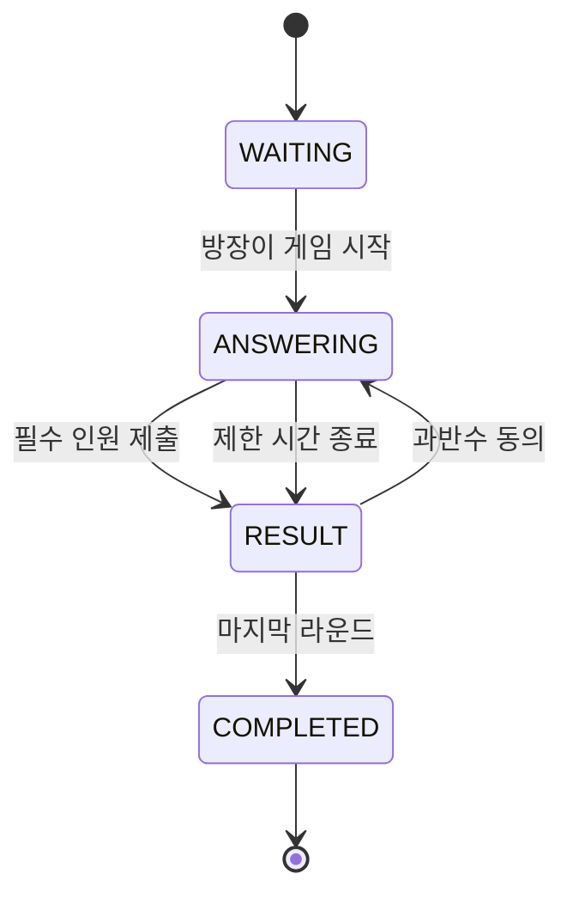

# I'm Press Server

> 방 코드로 참여해 서로의 첫인상을 맞히는 실시간 웹 게임 서버

## 프로젝트 소개

I'm Press는 별도의 로그인 없이 방 코드로 참여해 서로의 첫인상을 맞히는 실시간 웹 게임입니다.

참가자는 빈칸형, 개인 선택형, 공통 투표형 질문에 답하고 결과를 함께 확인합니다. 결과 화면에서 현재 연결된 참가자의 과반수가 동의하면 다음 라운드로 진행합니다.

| 구분    | 내용                       |
| ----- | ------------------------ |
| 팀 구성  | 백엔드 2명, 프론트엔드 2명, 디자인 2명 |
| 결과    | 해커톤 4개 팀 중 대상            |

## 게임 진행 흐름



## 주요 기능

### 방 생성 및 참가

* REST API를 통한 방 생성과 방 코드 기반 참가
* 현재 방 상태 및 참가자 정보 동기화
* 방장과 방 이름 조회
* 참가자 퇴장 및 최종 게임 결과 조회
* 동일한 방에서 참가자 이름이 중복되지 않도록 검증

### 실시간 대기방 동기화

* STOMP/SockJS를 이용한 참가자 입장 및 연결 종료 처리
* 참가자 접속 상태를 `CONNECTED`, `DISCONNECTED`로 관리
* 참가자 목록과 방 상태를 방 전체에 실시간 전송
* 방장 권한과 대기방 상태를 검증한 참가자 강퇴 처리
* 잘못된 요청은 요청자 개인의 오류 Queue로 전달

### 게임 및 라운드 관리

* 방장 권한과 참가 인원을 확인한 뒤 게임 시작
* 참가자와 질문 순서를 무작위로 구성
* 빈칸형, 개인 선택형, 공통 투표형 질문 제공
* 라운드를 `PENDING`, `ANSWERING`, `RESULT`, `COMPLETED` 상태로 관리
* 질문 유형에 따라 15초 또는 60초의 제한 시간 적용

### 답변 검증 및 결과 생성

* 방 소속, 게임 세션, 라운드 상태, 제한 시간, 중복 제출 검증
* 질문 유형에 따라 텍스트, 선택지 또는 참가자 답변 저장
* 현재 질문에 포함된 선택지와 방에 참여 중인 참가자만 선택 가능
* 현재 연결된 참가자의 ID 집합으로 라운드 종료 여부 판단
* 제한 시간이 지나면 미응답자가 있어도 제출된 답변으로 결과 생성

### 다음 라운드 진행

* 결과 화면에서 참가자별 다음 라운드 투표 처리
* 현재 연결된 참가자 수를 기준으로 과반수 계산
* 중복 투표 방지
* 기준 충족 시 다음 라운드 시작
* 마지막 라운드 종료 시 게임 세션과 방 상태 변경

## REST API

| Method   | Endpoint                                | 설명          |
| -------- | --------------------------------------- | ----------- |
| `POST`   | `/api/rooms`                            | 방 생성        |
| `POST`   | `/api/rooms/{roomCode}/join`            | 방 참가        |
| `GET`    | `/api/rooms/{roomCode}/sync`            | 현재 방 상태 동기화 |
| `DELETE` | `/api/rooms/{roomCode}/participants/me` | 방 퇴장        |
| `GET`    | `/api/rooms/{roomCode}/result`          | 최종 게임 결과 조회 |
| `GET`    | `/api/rooms/{roomCode}/host`            | 방장 조회       |
| `GET`    | `/api/rooms/{roomCode}/name`            | 방 이름 조회     |

## WebSocket

### 연결 정보

| 구분           | 경로                        |
| ------------ | ------------------------- |
| WebSocket 연결 | `/ws`                     |
| 클라이언트 요청     | `/app/rooms/{roomCode}`   |
| 방 전체 이벤트     | `/topic/rooms/{roomCode}` |
| 개인 오류 응답     | `/user/queue/errors`      |

### 요청 경로

| Destination                    | 설명        |
| ------------------------------ | --------- |
| `/app/rooms/{roomCode}/enter`  | 대기방 입장    |
| `/app/rooms/{roomCode}/kick`   | 참가자 강퇴    |
| `/app/rooms/{roomCode}/start`  | 게임 시작     |
| `/app/rooms/{roomCode}/answer` | 답변 제출     |
| `/app/rooms/{roomCode}/next`   | 다음 라운드 투표 |

## 기술 스택

| 분류                      | 기술                              |
| ----------------------- | ------------------------------- |
| Language                | Java 17                         |
| Framework               | Spring Boot                     |
| Real-time Communication | Spring WebSocket, STOMP, SockJS |
| ORM                     | Spring Data JPA                 |
| Database                | MySQL                           |
| Build                   | Gradle                          |

## 프로젝트 구조

```text
src/main/java/com/impress/server
├── answer          # 답변 도메인 및 저장
├── common          # 공통 응답 객체
├── game            # 게임 세션, 라운드 및 투표
├── participant     # 참가자와 연결 상태
├── question        # 질문과 선택지
├── room            # 방 REST API와 상태 관리
└── websocket
    ├── auth         # STOMP 참가자 식별
    ├── config       # WebSocket 설정
    ├── controller   # 실시간 요청 처리
    ├── listener     # 연결 종료 처리
    ├── publisher    # 이벤트 전송
    ├── scheduler    # 라운드 제한 시간 처리
    └── service      # 게임 진행 로직
```

## 실행 방법

### 실행 환경

* Java 17
* MySQL

### 환경 변수

```text
DB_URL=jdbc:mysql://localhost:3306/impress
DB_USERNAME=your_username
DB_PASSWORD=your_password
```

### 서버 실행

```bash
./gradlew bootRun
```

## 커밋 컨벤션

| 태그         | 설명                 |
| ---------- | ------------------ |
| `feat`     | 새로운 기능 추가          |
| `fix`      | 버그 수정              |
| `docs`     | 문서 수정              |
| `style`    | 코드 포매팅 등 코드 스타일 변경 |
| `design`   | 사용자 UI 디자인 변경      |
| `test`     | 테스트 코드 추가 및 수정     |
| `refactor` | 코드 리팩토링            |
| `build`    | 빌드 파일 및 의존성 수정     |
| `ci`       | CI 설정 파일 수정        |
| `chore`    | 기타 수정              |
| `rename`   | 파일 또는 폴더명 변경       |
| `remove`   | 파일 또는 폴더 삭제        |

### 커밋 메시지 작성 형식

```text
태그: 변경 내용
```

### 작성 예시

```text
feat: 방 생성 API 구현
fix: 중복 닉네임 검증 오류 수정
docs: API 명세 업데이트
refactor: 참여자 조회 로직 분리
```
